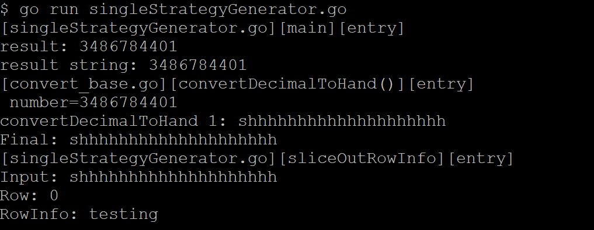
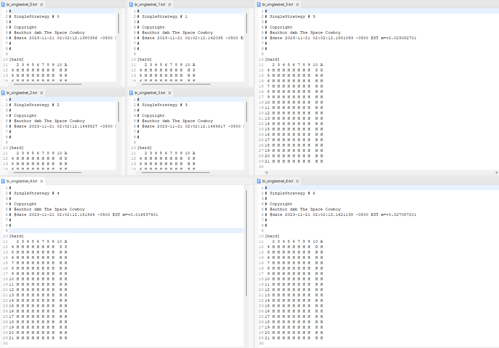
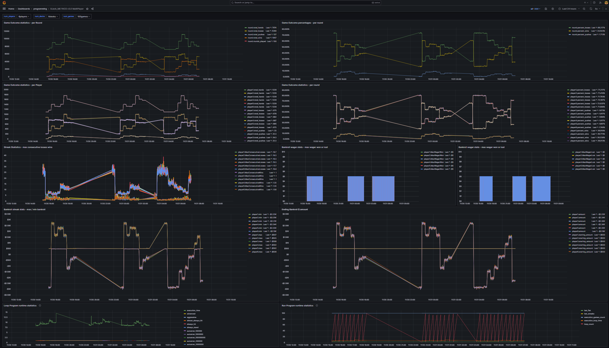

# Blackjack Autostrategy generator

```
A simulation program.

By dxb The Space Cowboy 

```

## Theory

The theory behind the auto-strategy generator is that:

In any card game, there is a finite number of moves that an individual player may make.

There may be lots of them , similar to the game of chess , however that number is

most definitely finite.

And , therefore , may be computed.

And so - the theory behind the auto-strategy generator is to generate every potential

move that any single individual blackjack player may make based on the up cards of the

dealers.  For, we use that to derive our potential win/loss ratio, do we not?  For example:

If I *always hit* no matter what (yes, even on 21) then my potential for winning any

single hand of blackjack is limited to the statistical possibilities that I recieve a total

of 21 on the very first deal.  This is quite possible.

My "strategy" to hit any card total of less than 21 (since I am force to stand and , quite

literally , do not have a choice in the matter when dealt 21) is naive at best, however

it is my choice, as a player player, to do what I want given the situation.

---

Expand this set of possibilities to include any upcard for the dealer, and any hand-total

for the player, and we have a limited set of possibilities.

---

The theory behind the strategy auto-generator is to do just that, generate every potential

"playing strategy" that a player can play, player.


### Example:

##### number 1

2-bits, base 2: a number from 0-3

equals four (4) possibilities (2^2)

[ 0, 0 ]
[ 0, 1 ]
[ 1, 0 ]
[ 1, 1 ]


##### number 2

2-bits, base 3: a number from 

equals nine (9) possibilities (3^2)

1) [ 0, 0 ]
2) [ 0, 1 ]
3) [ 0, 2 ]
4) [ 1, 0 ]
5) [ 1, 1 ]
6) [ 1, 2 ]
7) [ 2, 0 ]
8) [ 2, 1 ]
9) [ 2, 2 ]

##### number 3

2-bits, base 4: a number from

equals sixteen (16) possibilities (4^2)

1)  [ 0, 0 ]
2)  [ 0, 1 ]
3)  [ 0, 2 ]
4)  [ 0, 3 ]
5)  [ 1, 0 ]
6)  [ 1, 1 ]
7)  [ 1, 2 ]
8)  [ 1, 3 ]
9)  [ 2, 0 ]
10) [ 2, 1 ]
11) [ 2, 2 ]
12) [ 2, 3 ]
13) [ 3, 0 ]
14) [ 3, 1 ]
15) [ 3, 2 ]
16) [ 3, 3 ]

-----

##### number 4

3-bits, base 2: a number from

equals eight (8) possibilities (2^3)

[ 0, 0, 0 ]
[ 0, 0, 1 ]
[ 0, 1, 0 ]
[ 0, 1, 1 ]
[ 1, 0, 0 ]
[ 1, 0, 1 ]
[ 1, 1, 0 ]
[ 1, 1, 1 ]

##### number 5

3-bits, base 3: a number from

equals twenty seven (27) possibilities (3^3)

[ 0, 0, 0 ]
[ 0, 0, 1 ]
[ 0, 0, 2 ]
...
[ 0, 1, 0 ]
[ 0, 1, 1 ]
[ 0, 1, 2 ]
...
[ 0, 2, 0 ]
[ 0, 2, 1 ]
[ 0, 2, 2 ]
...
[ 2, 0, 0 ]
[ 2, 0, 1 ]
[ 2, 1, 0 ]
[ 2, 1, 1 ]
...
etc.
...
[ 2, 1, 2 ]
[ 2, 2, 2 ]
[ 2, 2, 2 ]
...
[ 2, 2, 0 ]
[ 2, 2, 2 ]
[ 2, 2, 2 ]
...
[ 2, 2, 1 ]
[ 2, 2, 2 ]
[ 2, 2, 2 ]
...
[ 2, 2, 2 ]
[ 2, 2, 2 ]
[ 2, 2, 2 ]


```
Conclusion:

The number of possibilities we have is the number of "possiblities"
exponent the number of "bits" (or entries in the matrix)
```

### Number of possibilities in Black Jack:

Given that the potential "number moves" are three (3):

* hit
* stand
* double-down (which is really a hit, so idk on this one, it only affects what can be done next, which is nothing, no matter what next card is dealt)
--> (tbd) "split" is also, actually, a potential first move, so this is not into consideration yet

Let's start lightly, with the first row:

matrix (from Always HIT):

[hard]
   2 3 4 5 6 7 8 9 10 A
 4 H H H H H H H H  H H
 
 We can have any number of three values in the 'value' for the row/column:
 
 Hit/Stand/Double
 
 So, it *could potentialy* look like this:

[hard]
   2 3 4 5 6 7 8 9 10 A
 4 H S D H S D H S  D H
 
We have three (3) possibilities (h/s/double) and ten (10) bits (column values)

And so our total number of possibilities are: 3^10 == 59,049

close to sixty (60) thousand

Yeah.

So, in reality, in this matrix:

[hard]
   2 3 4 5 6 7 8 9 10 A
 4 H H H H H H H H  H H
 5 H H H H H H H H  H H
 6 H H H H H H H H  H H
 7 H H H H H H H H  H H
 8 H H H H H H H H  H H
 9 H H H H H H H H  H H
10 H H H H H H H H  H H
11 H H H H H H H H  H H
12 H H H H H H H H  H H
13 H H H H H H H H  H H
14 H H H H H H H H  H H
15 H H H H H H H H  H H
16 H H H H H H H H  H H
17 H H H H H H H H  H H
18 H H H H H H H H  H H
19 H H H H H H H H  H H
20 S S S S S S S S  S S
21 S S S S S S S S  S S

There are 10-bits across and
There are 18-bits down
or
(10 x 18) == 180 bits total.  And there are three (3) possible columns for each value:

- s (stand)
- h (hit)
- d (double-down)

We have 180 "bits" or (potential column values) and three (3) possibilities for each column.

Therefore, the number of potential moves we can make is large , not as large as some

people traveling on a road-trip right now would like , however , it is still large enough

to know that it will be difficult to consume this with a single computer.

3^180

To give you an example: 3^20 is:

```
3,486,784,401
```

as compared to 3^10:

```
59,049
```

and compared to 3^30:

```
205,891,132,094,649
```


In fact, windows calculator will cringe at showing you how large 3^180 is.  It will merely show us:

7.617734804586638e+85

and so let's use a program to write it out.

Starting here:
 
 windows calculator says: 7.6177348045866392339289727720616e+85
 
 according to:
 
 ```
 	
 	package main()
 	
 	import(
 		"fmt"
 		"math"
 	)
 	
 	func main() {
    	res := math.Pow(3, 180) // 3^180
    	fmt.Println(res)
    }
    
```

**see resultant output down below**
 
which is basically 7.617734804 shifted right eight-five times, so imaginge a seven (7) with eighty five (85)
zeros (0) after it

7
000,000,000,
000,000,000,
000,000,000,
000,000,000,
000,000,000,
000,000,000,
000,000,000,
000,000,000,
000,000,000,
000,0


```
76,177,348,000,000,000,000,000,000,000,000,000,000,000,000,000,000,000,000,000,000,000,000,000,000,000,000,000,000
```

Now, that's Big.  She would be only happy with that number of inches.

To be precise, the above programmy program spits out:

```
76177348045866392339289727720615561750424801402395196724001565744957137343033038019601
```

We are not quite sure if anything else is spitting out anything right now, and who could be certain except for one or two
people on this entire planet anyway?  But, let's add some commas in order to visualize it all properly and put things
into perspective:

```

76,177,348,045,866,392,339,289,727,720,615,561,750,424,801,402,395,196,724,001,565,744,957,137,343,033,038,019,601

looks pretty close to:

76,177,348,000,000,000,000,000,000,000,000,000,000,000,000,000,000,000,000,000,000,000,000,000,000,000,000,000,000

```

and so, while the estimate of:

```

76,177,348,000,000,000,000,000,000,000,000,000,000,000,000,000,000,000,000,000,000,000,000,000,000,000,000,000,000

```

is pretty close to:

```

76,177,348,045,866,392,339,289,727,720,615,561,750,424,801,402,395,196,724,001,565,744,957,137,343,033,038,019,601

```

and so our previous teachers would all be happy that math brain estimation continues to work soo close to how it should.
Esp. when writing documentation, ( and not doing math ) , and brain can comprehend what it means to write fluently
in the English language.  And do math.  That said she would be even more happy with a very precise number.  

Hence the micrometer.

And the precision.

We can all appreciate precision. [ Yes?  No? | Si / No? | 1 | 0 ]


##### Conversion

Converting

```

76,177,348,045,866,392,339,289,727,720,615,561,750,424,801,402,395,196,724,001,565,744,957,137,343,033,038,019,601

```

into a strategy hand looks like

```

 shhhhhhhhhhhhhhhhhhhhhhhhhhhhhhhhhhhhhhhhhhhhhhhhhhhhhhhhhhhhhhhhhhhhhhhhhhhhhhhhhhhhhhhhhhhhhhhhhhhhhhhhhhhhhhhhhhhhhhhhhhhhhhhhhhhhhhhhhhhhhhhhhhhhhhhhhhhhhhhhhhhhhhhhhhhhhhhhhhhh
 
 ```
 
 and breaking this down into rows of ten (10) columns each we get:
 
 ```
 
 s
 4 - hhhhhhhhhh
 5 - hhhhhhhhhh
 6 - hhhhhhhhhh
 7 - hhhhhhhhhh
 8 - hhhhhhhhhh
 9 - hhhhhhhhhh
 10- hhhhhhhhhh
 11- hhhhhhhhhh
 12- hhhhhhhhhh
 13- hhhhhhhhhh
 14- hhhhhhhhhh
 15- hhhhhhhhhh
 16- hhhhhhhhhh
 17- hhhhhhhhhh
 18- hhhhhhhhhh
 19- hhhhhhhhhh
 20- hhhhhhhhhh
 21- hhhhhhhhhh
 
 
 ```
 
 This doesn't look close!  Shouldn't we have all 'd's in all columns, and not HIT strategy?!?  Okay, back to drawing board
 
 Okay, no.  So, this is one **more than** the final number of possibilities 
 in our matrix.  In fact, we should make a calculated number of what this is.
 
 And then add it to whatever number we want, in order to get the final 
 resultant output desired.
 
 ^^^ The above was a final thought in order to lead us in the right direction.  One step back,
 too big a number, and two steps forwards - add this very large number to the number we wan to
 display , and there we go!  Es muy muy muy, muy facil!  
 
 ```
 
 See code for more understanding.

``` 
 
 
 

### Journey Images

	I think that the program is trying to tell us to be quiet ....
    


	And then again, maybe not
	


	First run of 9-basic auto generated strategies.  Well, really 13, but the
	first four (4) I will not comment on, as they should be apparantly obvious
	from looking at the code what they are!
	

### Conclusion

=- The Space Cowboy