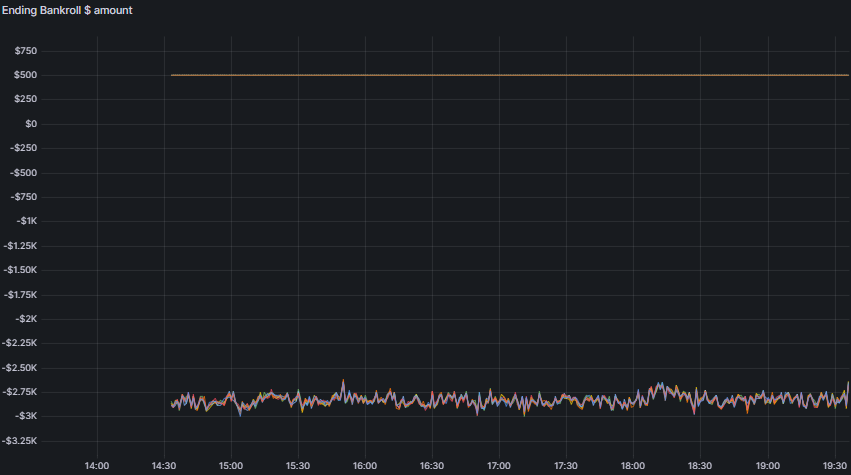
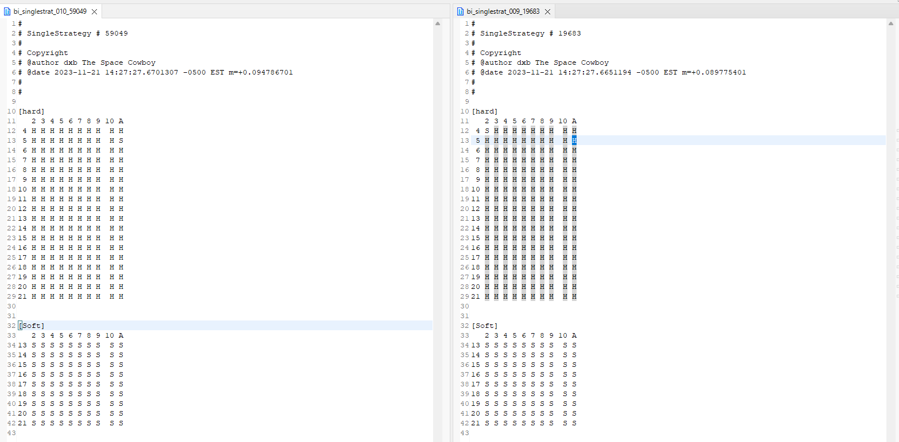
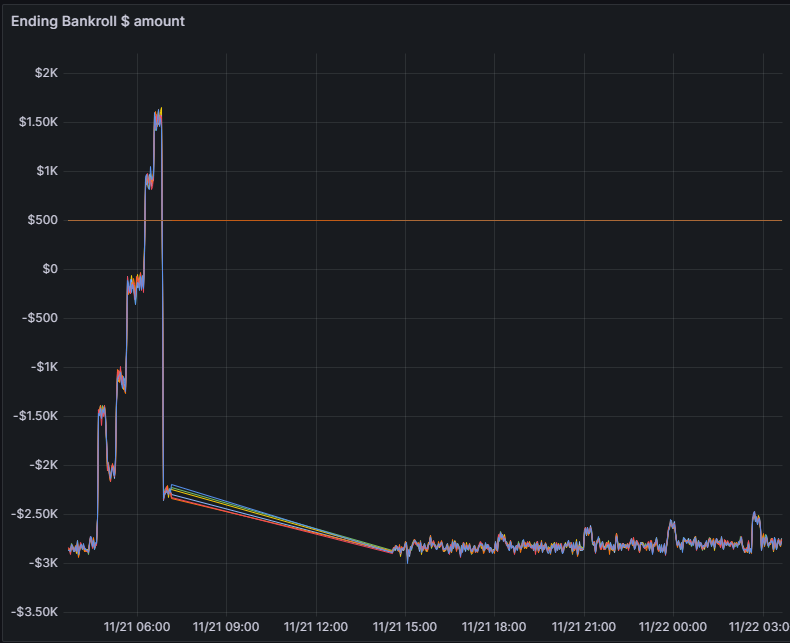
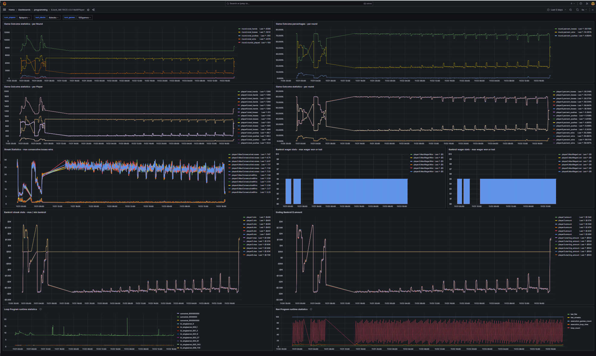

# Breaking Blackjack

## A story, nay ... An adventure!

by The Space Cowboy

### Corellations

I have noticed the following correlations thusfar:

Between strategy attempt #10 and #9, we have a slight change in outcomes.


There is a small hump in the results of strategy #10.  This happens during the simulation run between 18:00 and 18:30 hours.



The only difference here is in the decision of whether or not to:

```

Hit or Stand on a two-card total of five (5) with the dealer showing an Ace (A):

```



---

Additional:

strategies:

007
017
027

notables: 

``` 

stand on two-card total of 4 , dealer showing 4.

strategy 6 vs 7

slight decrease in bankroll loss

```

strategy 17

``` 

stand on two-card total of 5, dealer showing 4.

sligh decrease in bankroll loss.

```


strategy 27

```

stand on two-card total of 6, dealer showing 4.

slight decrease in bankroll loss

```

Humps in graph:



---

More:

strategies: 50, 60

Stand with dealer showing Ace, if two-card total of 9, 10

result graph shows less loss in bankroll.

----

strategies 59 to 60, 5+% win/loss difference, hitting on total of 10, dealer showing 10

----

## November '23

The first sim run is completed: I am very pleased with the results.  More encouraged, in fact.

The most notable run, in my opinion, is the very last one.  Double-down on everything.  Produced
the highest ending bankroll, with a simple flat-bet of $5.00 USD.

That's notable because, in essence, it leads in a direction that a favorable thing to do would be to:

```

always hit
and take one card only

``` 

The focus is on the inflection points in the graph to understand which strategies produced a
**significant change** in the win / loss ratio against the dealer.  

Here is an output for the last 3-days of computer simulations:

